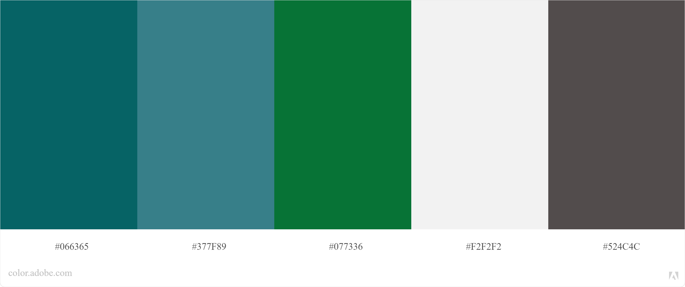

# site-konvex
Site da Konvex como projeto interno

## Para criar estilos CSS

Coloque seu arquivo css dentro da pasta css com o nome do componente que você está editando com esse estilo.

## Cores da marca

